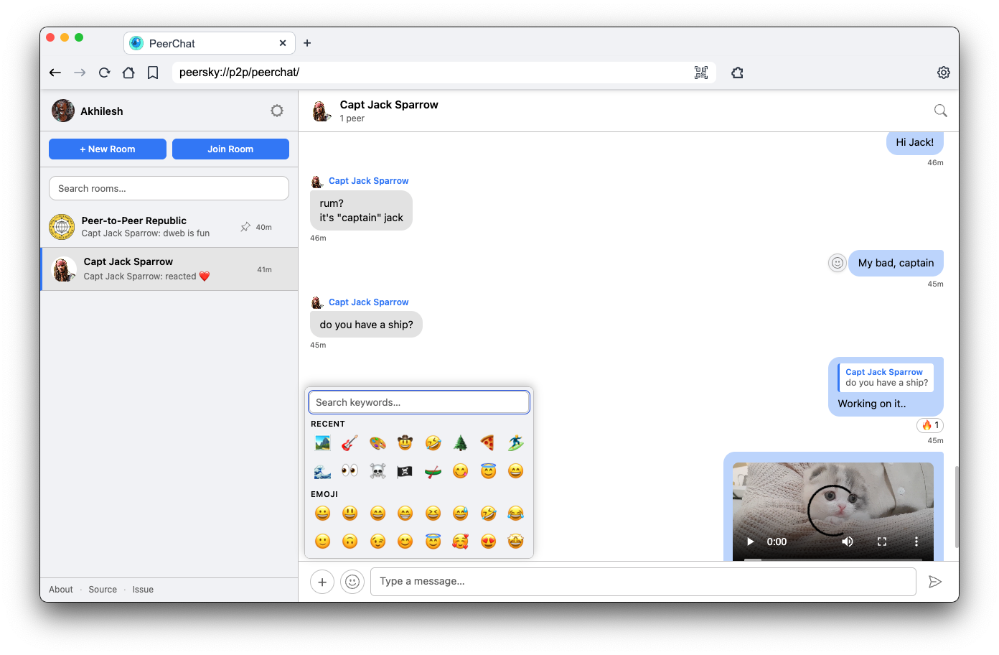
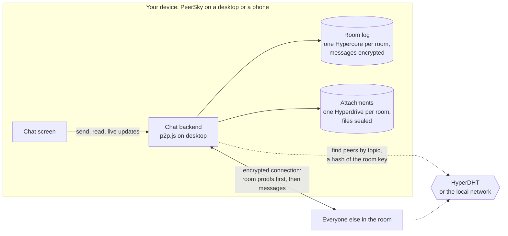
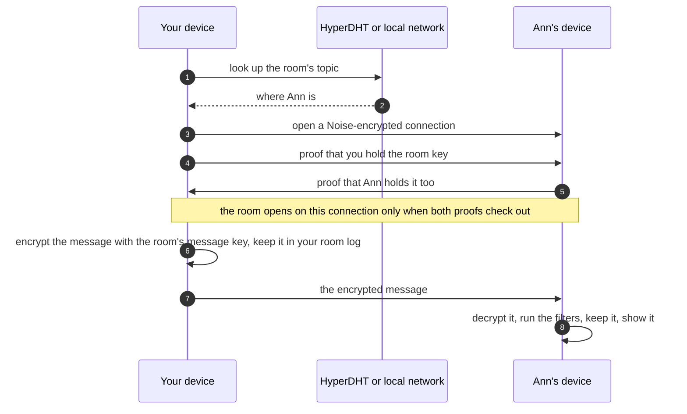

# PeerChat

<div align="center">
    
</div>

Chat inside [PeerSky Browser](https://github.com/p2plabsxyz/peersky-browser) on desktop and [PeerSky Mobile](https://github.com/p2plabsxyz/peersky-mobile) on iOS and Android. Phones and desktops talk in the same rooms: the phone has its own implementation of the same protocol, described in [docs/peerchat.md](https://github.com/p2plabsxyz/peersky-mobile/blob/main/docs/peerchat.md). You create a room, share a key, and everyone who has that key joins the same swarm, with no chat server in the middle. History starts at the moment you join; nobody backfills what came before.

**No accounts. No servers. Works without internet. End to end encrypted.** Messages go straight between the people in a room, encrypted on the sender's device with a key only the room holds, and a peer gets nothing about a room until it proves it holds that key. On a local network, rooms keep talking with the internet down.

**Everything stays local** on your machine (room list, profile, keys file), except what you explicitly sync over the peer network. **You own your chats:** there’s no company holding logs or resetting your password; the room key is the shared secret.

## Who this is for

Anyone who wants to talk without an account, a phone number or a company server in the middle, from friends and teams to journalists and the people they talk to.

**How it's encrypted**

- Every room and every direct message has its own key: 32 random bytes made on a member's device. Room keys never travel over the network; you share them yourself in an invite. A direct message's key goes only to the other person, inside the encrypted connection, after their key has been proved.
- Each message is encrypted on the sender's device with AES-256-GCM. In a newer room or direct message, meaning one made on PeerSky Mobile 0.1.2 or later or the desktop release that ships with it, the key changes every hour (see Forward secrecy below). In an older one it is derived from the room key. Files are encrypted with AES-GCM too, before they are stored, and in a newer room each file has a key of its own, which travels inside the encrypted message.
- Every connection between two devices is encrypted again with the Noise protocol and XChaCha20-Poly1305, with fresh keys for each connection.
- Every message and reaction is signed by whoever wrote it, so nobody can fake one, and a message another device in the room passes on arrives exactly as its author sealed it.
- A peer gets nothing from a room until it proves it holds the key, and no server exists that could log, read or hand over messages.

**Forward secrecy**

Connections have it: each one uses fresh keys, so traffic recorded today can't be opened later, even with a device's long-term keys.

Stored messages have it by the hour in newer rooms. Their messages are sealed with a key that changes every hour, and each hour's key is worked out from the one before it in a way that can't be run backwards. Somebody joining is given the current hour's key, never an earlier one. So whoever gets hold of the room key or an hour's key, from a forwarded invite or a lost device, can't read anything sent before that hour, even with a copy of it. Each device keeps the earliest key it was given, so its own history stays readable on it.

It protects the past, not the future: from a key you can work out every later hour's, so a stolen device or key keeps reading new messages until the room is replaced with a new one. Signal changes keys with every message and recovers after a key is stolen; PeerChat doesn't.

Older rooms, P2P Republic among them, keep one key for their whole life, so anyone who gets it can read every message in that room they can get a copy of, past and future. They stay that way so every version keeps reading them. Builds from before key rotation can't read newer rooms and direct messages; everyone in one needs to update.

**Also not there yet:** a way to confirm who is behind a key, like Signal's safety numbers, and an independent security audit.

## What it does

- Rooms with name, bio, optional link, and optional picture
- Messages stored in a **Hypercore** per room (append-only log), synced across peers
- Live delivery over **Hyperswarm** (Noise-encrypted transport), passed on from device to device so a message reaches people its author is not connected to, plus **SSE** (`receive-all`) so the web UI updates without polling every room
- Join / leave, @mentions, replies, **emoji reactions** on messages (stored in the room feed and synced like other events), **file attachments**, encrypted (in a newer room with a key of the file's own, in an older one with a key derived from the room key) and stored in a per-room Hyperdrive (`peerchat-…` entries in Settings -> Archive; the link alone yields ciphertext). Files of **any size** the devices have room for, as in Keet and the same as PeerSky Mobile. One over 100 MB is sealed and uploaded a megabyte at a time, and opened the same way, so the page never holds all of it.
- **Direct Messages (DMs):** click a peer's avatar to send a private message; the recipient gets an accept/decline popup. The conversation gets its own random room key, minted by whoever opens it and handed to the other person inside the invite, which travels on the Noise-encrypted connection that already proved who they are and goes only to their full public key, never to the 8-character peer ID, which can be ground to match
- Room list, unread counts, and local settings persist on disk
- **Messaging someone offline:** you can open a direct message with a peer who is not connected. The invite is re-sent the moment they reconnect, and the room shows a note saying the message arrives the next time you are both online. There is no server holding it in between.
- **Photos and videos are checked before they are sent:** an attachment carries only a `hyper://` URL, so the word list and the domain blocklist never see the picture itself. Every selected file is classified locally with a vendored NSFW model (`lib/nsfwjs.min.js` plus `lib/nsfw-model/`, no CDN and no build step) and an explicit one refuses the whole batch before anything is uploaded. Videos are sampled across several frames. Up to 10 files per send. The picker, drag-and-drop, the profile picture and the room picture all funnel through one screen, so a new way in cannot skip it. There is no folder upload; a dropped folder is a 0-byte pseudo-file and is refused. The rule adds the explicit classes together and weighs them with the suggestive one, because a single photo often splits its score so that no class looks decisive alone. **Incoming media is screened too**, the same way the text filters check inbound messages: the sending side can be stripped out by anyone running a modified build, so your copy decides what it will show you.
- **Blocking and reporting:** open a peer's profile to block them, which closes direct messages both ways and drops any request of theirs still waiting. They keep appearing in rooms you both belong to, and they are told their direct messages are blocked rather than left waiting on a reply. The list of blocked people, with unblock, lives in Settings. Report opens an email to the maintainers with the person's name, peer ID, the room's name, a short hash of its key (never the key itself) and the time filled in, so they can look at what happened.
- **Scam link warnings:** a link whose address is built to impersonate a real site is marked under its preview, with the reason in plain words. It catches a name stuffed before the real host (`paypal.com@evil.example`), a bare IP, lookalike characters (punycode), an address that reads as a file (`.zip`, `.mov`), a brand name outside its real domain, and shortened links. It is heuristics on purpose and not a blocklist, since phishing domains are burned within hours. Only the hostname is read, so an honest link that mentions a brand in its path is left alone. Worked out by the reader when the message renders, never trusted from the sender. The link still opens if you decide to open it.
- **Built-in moderation:** in groups, obvious abuse, spam bursts, profanity and slurs, and known adult-domain links are filtered before they reach the room feed. Room creators can toggle the abuse and profanity filters and choose a spam rate limit at room creation. Repeat live-message violations can trigger warnings and a short room rejoin cooldown. A direct message skips the content filters, since it is between two people and either can block the other; the spam limit still applies.
- **Room removal:** whoever created a room can remove anyone in it, permanently. The creator signs the room's removal list, so anyone in the room can pass it on and every peer checks it against the creator's public key, never against a self-reported field. That is how a removal reaches people who never meet the creator. Every peer then honours it: the removed peer is disconnected from the room, not relayed to, and nothing they send is read. It does not revoke the room key, so it is not a cryptographic bar. The automatic rejoin cooldown above is separate and stays a short pause.
- **Works with the internet down:** room topics are joined on an isolated LAN swarm too (`@p2plabs/hyperdht-mdns`, no public bootstrap), so peers on the same network keep talking. Needs a network, not an internet connection.
- **Emoji picker** in the message composer: type keywords to filter characters; data comes from [emojilib](https://github.com/muan/emojilib), vendored as `lib/emojilib-emoji-en-US.json`.
- **Link previews:** when an outgoing message contains an http(s) URL, the sender fetches the first link's title and description once and ships them in the encrypted message. Readers see a small card (text only, no image) instead of only a bare link, without ever connecting to the linked host. In a group, previews respect the room's filters (blocked/adult domains and filtered metadata never reach the feed). They can be turned off in Settings.

## How it works

Every device runs the whole chat by itself. There is no server to sign up with, so the full picture is you, the people in your rooms, and the network that helps you find each other:



And this is what happens between two people in a room when one of them says something:



Nobody in the middle sees a room key or a message. The DHT only ever sees topics, and a topic opens nothing on its own. The details:

**Room key.** A random 32-byte value shown as hex. It is the room's shared secret and never goes on the wire: frames name a room by its topic, and the only frames that carry a key are a direct-message invite, to the one person it is for, and the rooms one person's devices pass between themselves. Sharing an older room's key means sharing read access to that room’s history (with peers who actually have the blocks). A newer room's key lets someone in from then on, since its messages are sealed with hourly keys (below).

**Topic and message key.** Two separate values are derived from the room key, both `SHA-256` over a distinct context string:

| Derived value | Context | Where it goes |
| --- | --- | --- |
| Swarm topic | `peersky-chat:topic:` | Announced to DHT nodes during discovery |
| Message key | `peersky-chat:key:` | Never leaves the process |
| Attachment key | `peersky-chat:attachment:` | Never leaves the process; seals files in the per-room drive |
| Proof key | `peersky-chat:proof:` | Never leaves the process; keys the HMAC a peer proves the room with |

**Attachment format** (wire contract; mobile must match), under the attachment key above. Up to 100 MB, `PCA1` (4 bytes), a 12-byte random IV, then AES-256-GCM ciphertext with the 16-byte tag last. Past that, `PCA2`: a 16-byte header (`PCA2`, the frame size as a big-endian uint32, 8 random bytes), then each 1 MB frame's ciphertext followed by its tag. A frame's IV is the 8 random bytes and its index as a big-endian uint32, with the top bit set on the last frame, and the header is the additional data on every frame. The last frame is always shorter than a full one, empty when the file divides evenly, so frames cannot be reordered, resized or cut off the end. Both apps pin the same `PCA2` vector (`test/attachment-crypto.test.js` here, `test/protocol/peerchat-attachments.test.mjs` in PeerSky Mobile). The drive is named `peerchat-` + the first 32 hex of `SHA-256("peersky-chat:drive:" + roomKey)`; object names are opaque and the filename travels inside the encrypted message.

They are kept apart because the swarm topic is published. `dht.announce()` and `dht.lookup()` send the topic to whichever DHT nodes are nearest it in keyspace, so anything recoverable from the topic is effectively public. Deriving both from the room key with different contexts means an observer holding the topic learns nothing about the message key.

Earlier builds joined the swarm on the raw room key and derived the message key as `SHA-256("peersky-chat:" + roomKey)`. That published the room secret to DHT nodes and let them reconstruct the message key. If you ran a build from before this change, rooms created then should be recreated with fresh keys. Message history from those builds still decrypts, since the old derivation is retained for reading.

**Proving a room.** The topic is public, so knowing it opens nothing. On every connection each side sends `{ type: "topics", rooms: [{ topic, proof }] }`, where `proof` is HMAC-SHA256 under the proof key over `"peersky-chat/2 room\n" + handshakeHash + "\n" + senderPublicKey`, both as hex (`lib/room-proof.js`). The handshake hash is the Noise handshake's: the same at both ends of one connection and different on every other. The sender's key is the one that handshake proved. So a proof cannot be replayed on another connection or bounced back to the device that made it. A device opens a room to a peer only when that peer's proof checks out, and sends its own proofs before anything about the room, so a join never arrives ahead of the proof it needs. Being found under a room's topic on the DHT, or naming a room in any other frame, counts for nothing. Frames name rooms as `room: <topic>`, never `roomKey`. PeerSky Mobile makes and checks the same proof (`backend/peerchat/room-proof.mjs`), and both pin one vector (`test/room-proof.test.js`).

**Version 2.** The chat channel is `peersky-chat/2`. Builds before it handed the room key to anyone who turned up under a room's topic, and DHT nodes see topics go by, so a room used with one of those builds that has to stay private is worth recreating with a fresh key. The two versions do not open a channel with each other, so update every device together.

**Data path.** Outgoing messages are encrypted with **AES-256-GCM** using the message key, or in a newer room the hour's key (below). The feed stores ciphertext + IV + tag; peers decrypt after sync. The wire between peers is already encrypted by the swarm.

**Keys that rotate.** A newer room is marked by its key alone: `SHA-256("peersky-chat/3 rotates:" + roomKey)` starts with two zero bytes. A new room or direct message gets a key with that mark, about 65,000 tries and a fraction of a second, so no peer has to be trusted to say which rooms rotate, and an older room can never be given a chain. Next to its key the room keeps a chain: hours count from the Unix epoch (`floor(ms / 3,600,000)`), the chain starts with 32 random bytes made by whoever made the room for the hour it was made, the next hour's secret is `HMAC-SHA256(secret, "peersky-chat/3 next hour")`, and an hour's message key is `HMAC-SHA256(secret, "peersky-chat/3 message key")` (`lib/key-chain.js`). A message carries its hour as `e` and is sealed with that hour's key. One without `e` was sealed with the room's message key, by an older build or by a device that has no chain yet, and every build still reads it. Right after a room's details on each connection, and before any history, a device sends `{ type: "room-chain", room, e, secret }`: the current hour's secret, never an earlier one, and never to someone removed. That frame carries an hour's secret, not the room key. A device takes one only when it has no chain and only for an hour from two before its own to one after, keeps it, and passes it on to the others in the room. Files in a newer room are sealed with a `fileKey` of 32 random bytes, used where the room key would be (`SHA-256("peersky-chat:attachment:" + fileKey)`), and the `fileKey` travels inside the encrypted message. One person's devices pass the chain along with their rooms, and a device keeps the earliest start of the same chain. PeerSky Mobile follows the same rules in `backend/peerchat/key-chain.mjs`, and both pin one vector (`test/key-chain.test.js`).

**Process split.** The UI (`app.js`, static HTML/CSS) talks to `hyper://chat?action=…` over `fetch` and `EventSource`. The handler in `p2p.js` runs in the main process with the shared Hyper SDK instance: it joins swarms for each saved room, relays JSON lines between peers (newline-delimited), and broadcasts events to all connected SSE clients.

**Storage.** Room metadata, your profile, and encrypted room keys (when available) live in a JSON file under Electron user data (`CHAT_STORAGE` in `p2p.js`, wired from `hyper-handler.js`). Optional **safeStorage** encrypts that blob when the OS supports it.

**Joining again.** Use **Join room** with the 64-character key. For room metadata or keys stored in your archive, open **Settings -> Archive** in PeerSky and look under Hyperdrives for **peerchat-rooms**.

**Signed messages.** Every message and reaction carries its author's network key (`ak`), a header the author writes (`h`, a JSON string: the room's topic, the message id, its time, its hour in a newer room, the author's name, whether it was forwarded, and in an older room the reply and file details, which sit outside the sealed body there) and an Ed25519 signature over a label, `h` and the sealed body (`as`) (`lib/message-signature.js`; PeerSky Mobile signs the same bytes and both pin one vector). A device keeps `h` exactly as it came, so the message can go on and be checked again. A signed message counts from anyone once its signature checks out and its key is the one that id's connections proved, since a short id is 32 bits and a key can be ground to match one. An unsigned one, as an older build sends, counts only straight from its author's connection: somebody else's history used to name any author it liked. An older build ignores the three fields.

**Passing messages on.** A device keeps at most 64 connections, so in a big room most people are not connected to most others. A newer build says so in its handshake (`pass: true` in the `topics` frame) and passes each new signed message or reaction it takes on once, as `{ type: "pass", room, m }`, to everyone else in the room whose handshake said the same, never back where it came from or to its author. A copy a device has already seen stops at its first check, so a message crosses the room in a few steps. Only signed messages are passed on, only for ten minutes after they were written, and none from before the receiver joined; an older build never gets one. Limits count per author, not per connection, so a device passing on a busy room is never blamed for what others wrote: each author has the room's spam limit and 120 messages a minute, and a connection carries at most 1200 passed-on messages a minute.

**Room removal path.** The room records its creator's full public key, not the 8-character peer id, which is only 32 bits and can be ground for. New rooms record it at creation; the device that created an older room fills it in from its own key. A creator announces it in room metadata and a peer accepts it only when the announcing connection's public key is the key being announced, so it can only be learned from the creator. Removals travel as `{ type: "room-bans", room, bans, signed: { v, sig } }`, carrying no message id and no encrypted body, so builds predating them drop them at their first check. `sig` is the creator key's Ed25519 signature over `"peersky-chat/2 removals\n" + topic + "\n" + v + "\n"` and the list as JSON (`lib/removal-signature.js`; PeerSky Mobile signs the same bytes and both pin one vector). A signed list counts from anyone when its version is newer than the one held, and goes on to everyone else in the room. An unsigned one, from a build before signing, counts only from a connection whose key matches the creator key. Either way it replaces the list held. Pinned creator keys in `lib/room-moderation.js` override anything announced.

**One person on several devices.** Each device keeps its own network key, so each is its own member of a room: it receives every message and sends its own. PeerSky's transfers between a person's devices carry the profile, every room with its key, a label for the new device, and a link, a 32-byte secret the person's devices share (`lib/device-link.js`; PeerSky Mobile keeps the same rules). A device shows the name with its fixed label after it: `ada` on the device the name was made on, then `ada@mobile` and `ada@desktop1`, `ada@desktop2` for more desktops. The label cannot be edited. The `profile` frame carries `link: { id, name, bio, at, labels, mac }`, where `id` is public (`SHA-256("peerchat-device-link\n" + key)`, first 32 hex) and `mac` is HMAC-SHA256 under the link key over the name, bio, a hash of the picture, when they were set, the labels and the sending device's network key, so a proof passed on by anyone else fails on their connection. A device takes a name, bio and picture only from a profile whose proof checks against its own link and was set later than its own, so renaming on any device renames all of them, and nobody without the link can. Builds before this show the name with its label and ignore the rest. Once a peer has proved it is another of your devices on its own connection, the two send each other the rooms they are in (`link-rooms`, with the room keys), and a room joined on one device appears on the others that are online, or the next time they connect. A room left on a device stays left there: it is not taken back from your other devices until you join it again. A direct conversation goes along once the other person has accepted it. A desktop restored from another desktop has a copy of its store, so it keeps its room feeds under its own network key, starting from the copy: two devices appending to one feed would fork it, and hypercore freezes a forked feed for good.

**Moderation path.** Outgoing messages are checked locally before encryption. Live incoming messages are decrypted, checked, and either appended or replaced with a local system notice. History sync uses a content-only check so old filtered messages are not reintroduced when a new peer joins, while the syncing peer is not punished for replaying past history. Kick/rejoin checks use the author's proven identity instead of a self-reported message field: the connection for a message straight from it, the signature for one passed on.

### Blocking details

Blocking is user-initiated and separate from the automatic moderation below. It
is stored locally in `blockedPeers` and never announced to anyone but the peer
it applies to.

- A blocked peer's `dm-invite` is answered with a `dm-blocked` frame and dropped.
- Anything they send into a direct room you share with them is dropped, while
  rooms you both belong to keep working.
- `join-dm` and `send` refuse with 403 in both directions once a block is in
  place, so neither side can keep the conversation going.
- Blocks survive a restart and are capped at 500 entries.

### Moderation details

All moderation runs **locally on each peer**, with no central authority. Even if a remote peer strips moderation from their build, your node still filters their messages independently.

**Per-room moderation settings.** Room creators configure moderation at creation time in the create-room modal. Settings are immutable after creation (there is no admin role), and peers verify/sanitize them when syncing room metadata:

| Setting | Default | Description |
|---------|---------|-------------|
| Abuse filter | On | Blocks threats and targeted harassment (`kys`, "kill yourself", rape threats, `stfu`) |
| Profanity & slurs | On | Blocks the ~850-term word list in `lib/bad-words.txt`: slurs, profanity, and explicit sexual terms |
| Spam rate limit | 10 msgs / 10s | Configurable 5, 10, or 15 messages per 10-second window |
| Adult domain blocklist | Always on | Not toggleable; ~76K known adult domains are always blocked |

**Content filters** (applied to every message in a group):

| Filter | What it catches | Source |
|--------|----------------|--------|
| Threat patterns | Threats and targeted harassment | `THREAT_PATTERNS` regex list in `moderation.js`, gated by the abuse filter |
| Word list | Slurs, profanity, explicit sexual terms | `lib/bad-words.txt`, loaded via `initModeration()`, gated by the profanity & slurs filter |
| Adult domain blocklist | ~76K known adult domains extracted from URLs in messages | `lib/adult-domains.hosts`, loaded asynchronously at startup via `initModeration()` |

**Direct messages** skip the content filters: threats, the word list and the adult domain list. A direct message is between two people, and either can block the other, so what they send each other is up to them. The spam limit below still applies, and a picture or video that looks explicit still arrives hidden behind a warning that the reader can open. The flag that turns the filters off is worked out from the room on each device, never stored with the room or sent to peers, so no room setting can switch a group's filters off this way.

**Spam detection** (remote peers only; local user is exempt):

- A sliding window of `MAX_MSGS_PER_WINDOW` (default **10**) messages within `WINDOW_MS` (default **10 seconds**).
- The 10th message in the window triggers a spam violation.
- Local outgoing messages skip the spam check since they are separately rate-limited at the HTTP handler level (60 requests / 60 seconds).

**Escalation ladder** (tunable constants in `moderation.js`):

| Violation count | Action | Effect |
|-----------------|--------|--------|
| >= `WARNING_THRESHOLD` (1) | `warn` | Message blocked; toast: "Message blocked - please rephrase." |
| >= `FINAL_WARN_THRESHOLD` (2) | `final-warn` | Message blocked; toast: "Message blocked again - please rephrase before sending." |
| >= `KICK_THRESHOLD` (3) | `kick` | **Remote peers:** blocked from all room-scoped message types for `ROOM_REJOIN_COOLDOWN_MS` (5 min). **Local user:** capped to `final-warn` (never self-kicked). |

**Kick cooldown and violation reset:**

- A kicked remote peer is blocked from chat messages, reactions, sync-reactions, room-meta updates, members-list pushes, join announcements, and leave notices for the full cooldown period.
- When the cooldown expires the peer's **violation count resets to zero**, so their next offense starts fresh at `warn`, not an instant re-kick.
- The violation counter also resets independently after `TRACKER_IDLE_TTL_MS` (30 minutes) of inactivity, even without a kick.
- A kicked peer is blocked from syncing history to you directly, but a **third peer can still relay their older messages**, which arrive content-checked only. That is deliberate: the relaying peer should not be punished for replaying history they hold.

## Security

These apps solve different problems; the table is to set expectations, not to pick a “winner.”

| | **Signal** | **Matrix (e.g. Element)** | **PeerChat** |
|---|------------|---------------------------|--------------|
| **Shape** | Central service, E2E by default | Federated homeservers; E2E optional per room | **P2P:** no chat servers; Hyperswarm + Hypercore; E2E always |
| **Account** | Phone number | Matrix ID + homeserver | **None** |
| **Without internet** | No | No | **Yes**, on a local network |
| **Pros** | Strong E2E story, PFS, large user base, safety numbers | Self-host, bridges, optional E2E | **No signup;** data synced directly between peers; you control local files |
| **Cons** | Depends on Signal’s infrastructure and updates | Server sees metadata; E2E history can be fiddly | **Room key = full access** to history for anyone who gets it; **no PFS** on the room key; metadata on the network is a research topic |
| **Good when** | You want mainstream, audited E2E messaging | You want federation or a public server | You want **local-first** chat, in the same app as Hyper browsing |
| **File uploads** | Platform limits | Varies by server | **No limit** |

**P2P angle:** PeerChat avoids a message database run by a third party. Desktop
uses the default `bonjour-service` LAN adapter; mobile can inject a system
Bonjour or Android NSD adapter through the same two-method interface. Noise
protects the bytes on the wire; on disk, message content is protected by the
**room key** in an older room and by the hourly key chain in a newer one.
That’s simpler than Signal’s ratchet, and also **weaker** if a key is stolen or
shared carelessly.

### PeerChat specifics

- **Room key is the capability, and only the key.** Anyone with it can join the room and read it: all of an older room, and a newer room from the hour they join. A peer without it gets nothing, even one that found the room's topic on the DHT: a room opens on a connection only to a peer that proves it holds the key. Treat it like a strong shared secret.
- **A direct message has its own key**, 32 random bytes like any room's. Earlier builds derived it as `sha256(<the two 8-character peer IDs, sorted>)`, and peer IDs are public: they are in every member list and on every personal invite code, so anybody who knew both could work out the key, join the topic and read the conversation and its attachments. The key is now minted and sent inside the `dm-invite`, which only travels on a connection whose public key the handshake has already proved. It goes to the person's full public key, recorded when the conversation starts and checked on every answer, never to an 8-character peer ID: those are 32 bits, and a key can be ground to match one. A personal invite link or QR code carries the full key, so a request from one goes to that key alone. One started from a member list, or from an older link with only the 8-character ID, goes to the one connected key with that ID, and while two share it, it waits. Conversations created before this keep their derived key and stay readable to anyone who can work it out; start a new one to get a private one. Both ends need a build with this change, because older ones check an incoming key against the old derivation and drop anything else.
- **The room key is never sent.** Discovery uses a topic derived from it, so DHT nodes servicing your lookups cannot work back to the key or the message key, and the key does not travel in frames either: rooms are named by topic and opened by proof. Rooms created by builds from before the topic split, or used with builds before `peersky-chat/2`, should be recreated with fresh keys.
- **No “real” host** in the network sense: peers are symmetric. “Host” in the UI only marks who created the room on that device.
- Rate limits, a max **message text** length, and moderation filters cut spam and obvious unsafe content in the feed; file uploads have **no size limit** in the app. Inline image/video previews are automatically shown for files up to 100 MB; larger files render as a click-to-load placeholder card. The UI escapes text before rendering to limit XSS.
- Moderation is local and heuristic, not a trust or safety service. It helps with accidental exposure and noisy peers, but it does not replace trusted room keys, identity verification, or user judgment.
- **Not** Matrix/Signal-class identity, device verification, or perfect forward secrecy.

## Development

### Tests

PeerChat has no dependencies of its own; it uses the ones the host browser already installs. Run the suite from inside a PeerSky checkout, where `node_modules` resolves:

```bash
cd src/pages/p2p/peerchat && node --test "test/*.test.js"
```

To run from a standalone clone, point `node_modules` at a PeerSky checkout first:

```bash
ln -s /path/to/peersky-browser/node_modules node_modules && node --test "test/*.test.js"
```

`test/crypto.test.js` and `test/attachment-crypto.test.js` cover the key derivations, including that an observer holding only the announced topic cannot decrypt. `test/two-peer.test.js` and `test/transport.integration.test.js` run real peers against an isolated `hyperdht` testnet. The rest cover routing, transport, moderation, offline delivery, rendering and scroll behaviour.

### Chat API 

PeerChat provides a clean JavaScript API in `chat-api.js` that wraps the protocol handler. Import and use it in your app:

```js
import { chat } from "./path/to/peerchat/chat-api.js";

// Get user profile
const profile = await chat.getProfile();

// Get all rooms
const { rooms, peerProfiles, onlinePeers, blockedPeers } = await chat.getRooms();

// Send a message
try {
  await chat.sendMessage(roomKey, { message: "Hello!" });
} catch (err) {
  if (err.status === 403 && err.moderation === true) {
    // Message was blocked locally; check err.error, err.action, and err.remainingMs for details.
  }
}

// React to a message
await chat.react(roomKey, { msgId, emoji: "👍" });

// Subscribe to live updates
const es = new EventSource(chat.receiveAllUrl());
es.addEventListener("message", (ev) => {
  const msg = JSON.parse(ev.data);
  // Handle incoming message
});
```

**Available methods:**
- `chat.getProfile()`: Get current user profile
- `chat.getRooms()`: Get all rooms, peer profiles, online status
- `chat.saveProfile(body)`: Update username, bio, avatar, notifications
- `chat.createRoom(body)`: Create new room with name, bio, link, avatar
- `chat.joinRoom(roomKey)`: Join room by key
- `chat.getHistory(roomKey)`: Get message history for room
- `chat.setActive(roomKey)`: Mark room as active
- `chat.markRead(roomKey)`: Mark room as read
- `chat.sendMessage(roomKey, body)`: Send message with optional reply, file
- `chat.react(roomKey, body)`: React to message with emoji
- `chat.joinDM(body)`: Initiate DM with peer
- `chat.acceptDM(body)`: Accept incoming DM request
- `chat.rejectDM(body)`: Reject incoming DM request
- `chat.blockPeer(body)`: Block a peer's direct messages (`{ peerId, username }`); returns the updated block list and pending requests
- `chat.unblockPeer(body)`: Unblock a peer (`{ peerId }`); returns the updated block list
- `chat.updateRoom(roomKey, body)`: Update room settings (pin, mute)
- `chat.deleteRoom(roomKey)`: Leave room
- `chat.requestMeta(roomKey)`: Broadcast a request to connected peers to re-send room metadata (name, bio, avatar, creator)
- `chat.receiveAllUrl()`: Get SSE endpoint URL for live updates

### Porting to another Hyper browser

Copy the `chat/` folder. Your browser already needs a **single shared Hyper SDK** instance (same pattern as PeerSky: one swarm for browsing + apps).

#### 1. Import and initialize after `createSDK`

Use your own path to `p2p.js`. On Electron you can pass `safeStorage` and a file under `userData`; elsewhere omit `safeStorage` or stub it.

```js
import path from "path";
import { app, safeStorage } from "electron"; // or skip safeStorage
import {
  initChat,
  handleChatRequest,
  CHAT_STORAGE,
} from "./path/to/peerchat/p2p.js";

// After: sdk = await createSDK(options)
initChat(sdk, {
  safeStorage, // optional; Electron only
  storagePath: path.join(app.getPath("userData"), CHAT_STORAGE),
});
```

`CHAT_STORAGE` is the JSON filename (`peersky-chat-rooms.json`); change the export in `p2p.js` if you want a different name for your software.

#### 2. Route `hyper://chat` to the handler

PeerSky branches **before** generic `hypercore-fetch` handling so chat never hits the default Hyper resolver. Match your URL shape; PeerSky uses hostname `chat` or path `/chat`:

```js
export async function createHandler(options) {
  await initializeHyperSDK(options); // must call initChat inside this

  return async function protocolHandler(req) {
    const urlObj = new URL(req.url);
    const protocol = urlObj.protocol.replace(":", "");
    const pathname = urlObj.pathname;

    if (
      protocol === "hyper" &&
      (urlObj.hostname === "chat" || pathname.startsWith("/chat"))
    ) {
      return handleChatRequest(req, sdk);
    }

    // …existing hyper:// handling (fetchFn, etc.)
  };
}
```

#### 3. Say when the person is away (optional)

People in a room with you see a yellow dot and "Idle" while you are away, and green while you are here. Only your browser knows which, so it tells PeerChat:

```js
import { setPresenceIdle } from "./path/to/peerchat/p2p.js";

setPresenceIdle(true); // screen locked, computer asleep or idle, or another app in front
setPresenceIdle(false); // back
```

PeerSky works it out in `src/peerchat-presence.js`. Without it everyone sees you as here whenever you are online. Group headers count people online, away or not; the member list and a person's card say which.

### Theming

`styles.css` imports [`browser://theme/vars.css`](https://github.com/p2plabsxyz/peersky-browser/blob/main/docs/Theme.md) and maps layout colors from **`--browser-theme-background`**, **`--browser-theme-text-color`**, **`--browser-theme-primary-highlight`**, **`--browser-theme-secondary-highlight`**, and **`--browser-theme-font-family`**, with Peersky extras (`--peersky-nav-background`, `--base02`, etc.) when present. The UI should follow PeerSky’s selected theme and stay compatible with other browsers that implement the same protocol.

> All sound effects used in PeerChat are royalty-free and sourced from [Pixabay](https://pixabay.com/).
